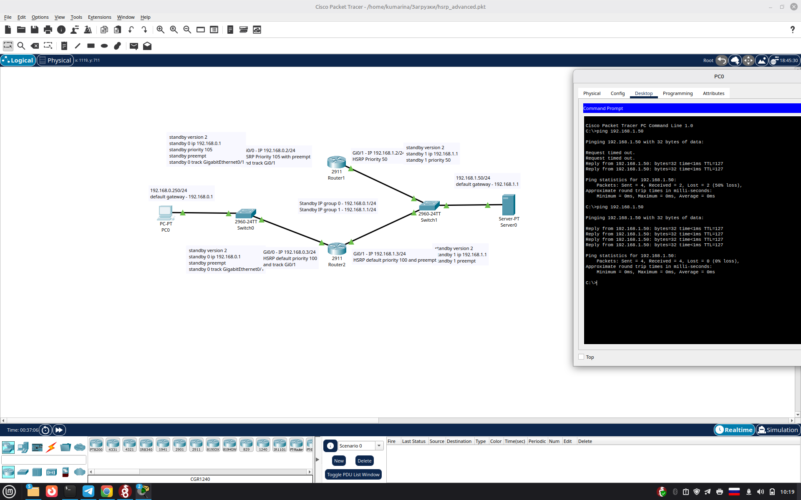
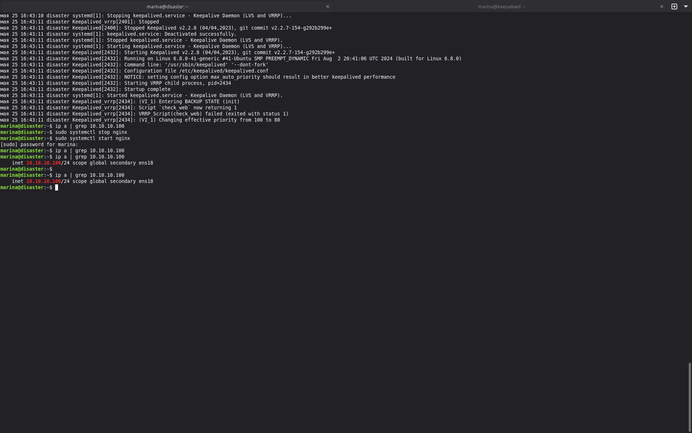
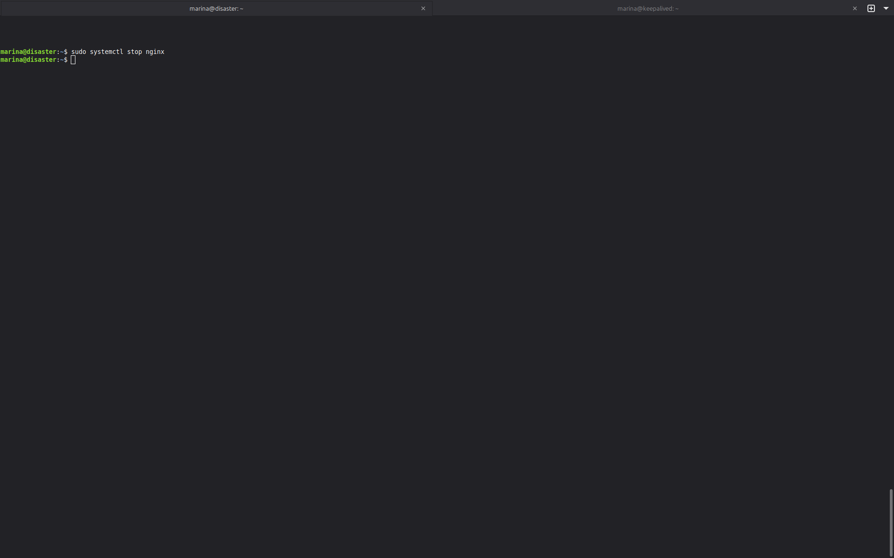
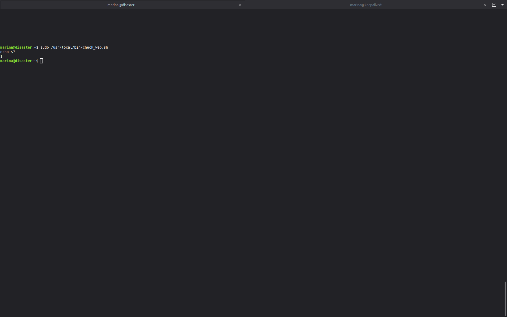
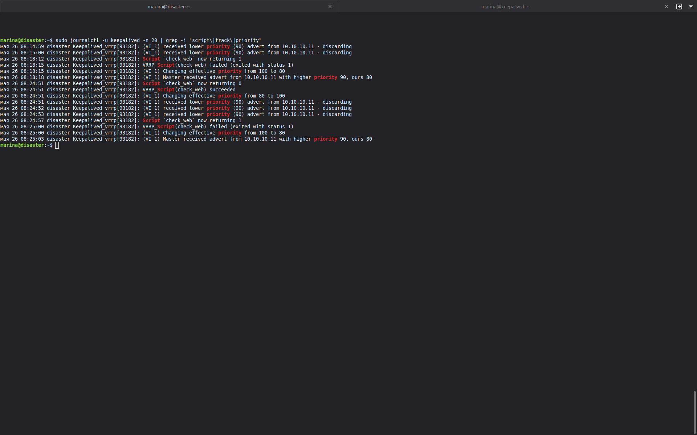
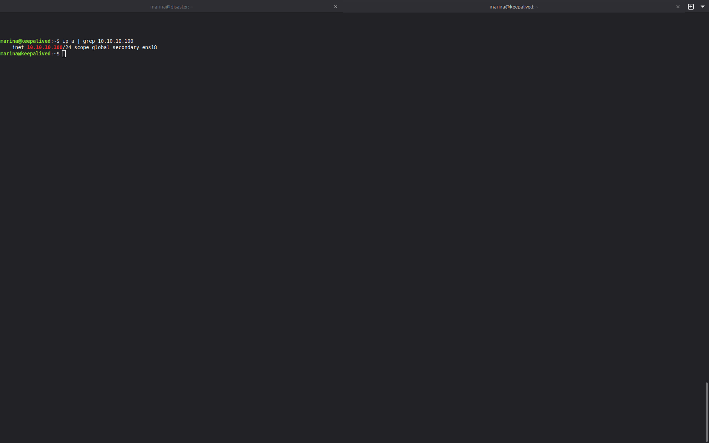
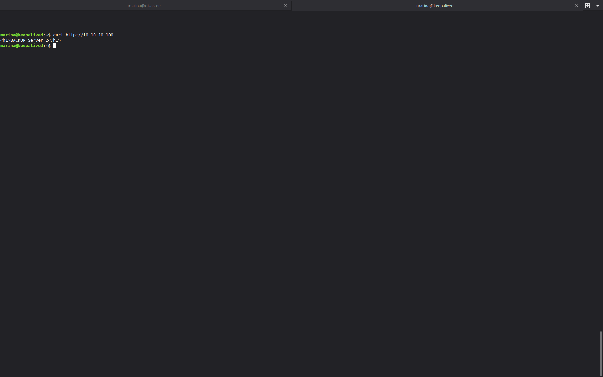

# Домашнее задание к занятию «Disaster Recovery. FHRP и Keepalived» Кукушкина Марина


## Задание 1

## Настройка маршрутизатора


## Результат пинга после обрыва кабеля



## Файл схемы

[scheme.pkt](screenshots/hsrp_advanced2.pkt)

# Задание 2: Keepalived + веб-сервер (NGINX)

## 📌 Описание задания

1. Запущены две виртуальные машины Linux (Proxmox) с IP-адресами:
   - `10.10.10.10` (MASTER)
   - `10.10.10.11` (BACKUP)

2. На обеих ВМ установлен и настроен веб-сервер **NGINX**.

3. Написан **bash-скрипт**, который проверяет:
   - Доступность порта 80 веб-сервера
   - Наличие файла `index.html` в корневой директории

4. Настроен **Keepalived** с секцией `vrrp_script`, который:
   - Запускает скрипт проверки каждые 3 секунды
   - Переносит виртуальный IP (`10.10.10.100`) на резервный сервер при ошибке скрипта

---

## 📁 Файлы конфигурации

### 1. Bash-скрипт проверки (`/usr/local/bin/check_web.sh`)

```bash
#!/bin/bash

PORT=80
WEB_ROOT="/var/www/html"
INDEX_FILE="index.html"

# Проверка доступности порта
timeout 2 bash -c "echo > /dev/tcp/localhost/$PORT" 2>/dev/null
if [ $? -ne 0 ]; then
    exit 1
fi

# Проверка существования файла index.html
if [ ! -f "$WEB_ROOT/$INDEX_FILE" ]; then
    exit 1
fi

exit 0
```

### 2. Конфигурация Keepalived

### MASTER (10.10.10.10) — /etc/keepalived/keepalived.conf

``` bash
global_defs {
   enable_script_security
}

vrrp_script check_web {
   script "/usr/local/bin/check_web.sh"
   interval 3
   weight -20
   fall 2
   rise 1
   user root
}

vrrp_instance VI_1 {
   interface ens18
   state MASTER
   virtual_router_id 51
   priority 100
   virtual_ipaddress {
        10.10.10.100/24
   }
   track_script {
      check_web
   }
}
```

### BACKUP (10.10.10.11) — /etc/keepalived/keepalived.conf

``` bash
global_defs {
   enable_script_security
}

vrrp_script check_web {
   script "/usr/local/bin/check_web.sh"
   interval 3
   weight -20
   fall 2
   rise 1
   user root
}

vrrp_instance VI_1 {
   interface ens18
   state BACKUP
   virtual_router_id 51
   priority 90
   virtual_ipaddress {
        10.10.10.100/24
   }
   track_script {
      check_web
   }
}
```
## 🧪 Демонстрация переезда VIP

### 1. Виртуальный IP на MASTER (до отключения)



### 2. Остановка веб-сервера на MASTER


### 3. Проверка, что скрипт возвращает ошибку


### 4. Лог Keepalived (скрипт упал, приоритет снижен)


### 5. Виртуальный IP переехал на BACKUP


### 6. Проверка веб-сервера через VIP

